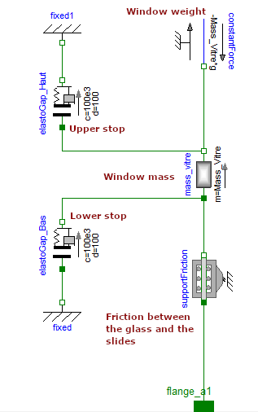

# Chapiter 2 : Fundamental Concepts of Multi-Physics Modelling with Lumped Parameters   
  
 
## 5.1. Review of Kirchhoff's laws in multi-domain modeling


#### 1)	On which quantities are the laws of nodes applied?
The force $F$, the moment $T$, the current $i$, the flow $\dot{Q}$    

#### 2)	On which quantities are the laws of mesh applied?
Speed $v$, angular velocity $ω$, voltage $v$, temperature $θ$

#### 3) How do these two types of quantities (across and through) differ in the interface code and when associating components in a Modelica model?
On the example of an electrical connector, in the Modelica code:
```
connector Pin "Pin of an electrical component"  
  SI.Voltage v "Potential at the pin";     
  flow SI.Current i "Current flowing into the pin";  
end Pin;
```
The presence of the "flow" prefix allows you to designate the variable for which the node law is applied.    
The absence of the prefix "flow" indicates a variable for which the mesh law applies.

#### 4) What is the difference between the mechanical, electrical and thermal fields?
In the mechanical and electrical fields, the product of the voltage/current and force/speed variables give power.
But in thermal, the heat flow is already a power.

#### 5) Recall the notion of power variables and energy variables used by Modelica
Power variables are the quantities necessary to describe the laws of nodes and meshes.
The energy variables are the primitive quantities of the power variables (e.g. electric charge $q$, magnetic flux $φ$)

#### 6)  Give the expressions of the dissipated powers or energies stored in these different elements
**For a dissipative effect:**
  - In translation mechanics: $ P=f.v^2 $ 
  - In mechanical rotation: $P=d.ω^2$
  - In electricity: $P=R.I^2$ 
    
    
   - Be careful in thermal, the heat flow is directly a power (coming from other domains)
  
**For an energy storage effect of the "capacity" type:**
  - In mechanical translation: $E=\dfrac{1}{2}k_t.z^2$ 
  - In mechanical rotation: $E=\dfrac{1}{2}K_r.\theta^2$ 
  - In electricity: $E=\dfrac{1}{2}C.v^2$ 
  
    
  - Attention in thermal: $E=C_{th}.\theta$, by direct integration of the heat flow

**For an energy storage effect of the "inertia" type:**
  - In mechanical translation: $E=\dfrac{1}{2}m.v^2$
  - In mechanical rotation: $E=\dfrac{1}{2}J. \omega^2$ 
  - In electricity: $E=\dfrac{1}{2}L.i^2$ 

#### 7) By analogy with the rest of the table, propose a column for the hydraulic field 
**Power variable** : Flow rate $Q_h~[m^3/s]$ and Pressure $P~[Pa]$   
**Dissipative effect**: Laminar hydraulic resistance (low flow rate) $\Delta P=R_h.Q_h$    
        *Note*: In turbulent (high flow) the pressure drop is a function of the square flow.    
**Energy storage effect (capacity)** : Hydraulic capacity $Q_h=C_h. \dot{P}$   
**Energy storage effect (inertia)**: Hydraulic inertance $\Delta P=L_h. \dot{Q}_h$  

 
## 5.2.	Questions about the power window example


#### Resources to download: Model for simulating a window lifter

A model of the power window is available: : [Chap2_PowerWindow.mo](files/Chap2_PowerWindow.mo)    


#### 1) Write the equations linking the electrical variables to the mechanical variables

$v = Ri+L\frac{di}{dt}+k\Omega$  
$J_{motor}\frac{d\Omega}{dt} = k.i - T_{ch}$

#### 2)	Which Kirchhoff's law applies to the reducer link / compensation spring / chisel mechanism? What is the interest of the compensation spring?
The law of nodes is applied here : the sum of torques equals 0. The spring is used to apply a torque that compensates for the effect of the weight of the glass. The spring thus makes it possible to reduce the torque to be supplied by the motor.


#### 3) Specify what each Modelica component models



#### 4)	In the window lift mechanism, give the main transformer effects and the simplest equations to take them into account

The transforming effects are as follows:
- Electric motor: voltage ($E$) / current ($I$) at rotation speed ($\Omega$) / torque ($C$): $C=kI$ and $E=k\Omega$
- Wheel and worm: change from speed/torque to speed/torque with a reduction ratio (decrease in speed, increase in torque): $N=\Omega_1/\Omega_2 = C_2/C_1$  
- Pinion/wheel assembly: change from speed/torque to speed/torque with a reduction ratio (decrease in speed, increase in torque): $N=\Omega_1/\Omega_2 = C_2/C_1$  
- Scissor mechanism: change from rotational speed/torque to travel speed/effort: $L_{arm}=v/\Omega=C/F$ 


## 5.3.	Multiple-choice questions on the modeling of technological components


#### 1)  Make the link between the effects and the different elements of the diagram :

Perfect transformer: **d**  
Joule losses in copper: **a**  
Magnetization of the magnetic circuit: **c**  
The imperfect coupling of the primary and secondary (leakage flow): **b**    
Iron losses of the magnetic circuit: **e**  


#### 2) Check the Modelica diagram that best corresponds to this component :

 Answer : **b**

#### 3) a) The model here represents displacements :
 Vertical 

#### 3) b)	Link effects to schematic elements 
Shock absorber : **c** (viscous friction part)  
Coil spring: **c** (spring part)  
Tire: **e**    
Vehicle body (weight): **a**     
Vehicle body (inertia): **b**     
Wheel rim (inertia) : **d**    
Position of the road:  **f**   

The weight of the rim could have been taken into account by an additional force source connected to the mass d.


## Next : [Chapiter 2. Problemes](Chapiter 2. Problemes.ipynb)

 
