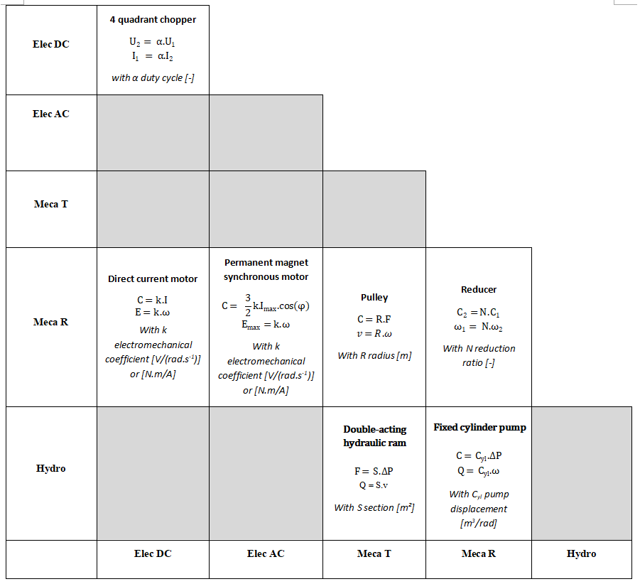
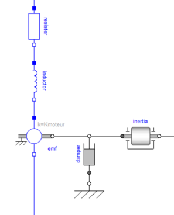
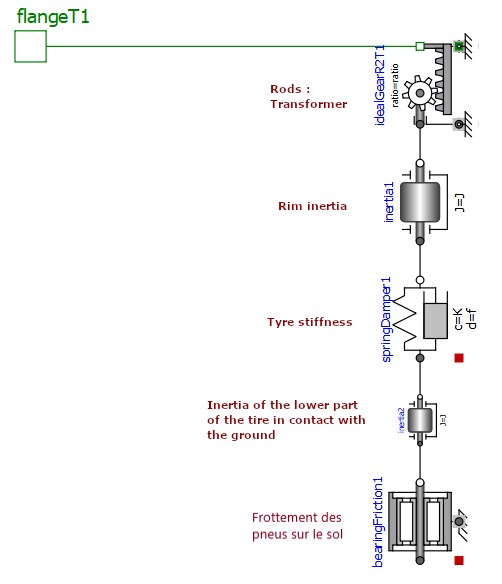

# Chapter 3 : Setting up a lumped parameter model 
  
 
 
## 5.1. Setting up analysis reflexes : Storage and dissipative effect

#### 1)	Depending on the phenomenon to be modelled, tick in the table according to the physical domain and the type of effect to be taken into account :
1) **a and f**   
2) **b/c and h**   
3) **b/c and g**    
4) **a and h**    
5) **e and h**   
6) **a and g**    
7) **d and f**   
8) **e and f**    
9) **e and h**      
10) **c and g**     
11) **b/c and f**     
12) **d and h**    
13) **d and f**   

#### 2) For the technical devices represented below, indicate the dominant effect for each part (a) to (e) :
a) Spring    
b) Inertia (mass in translation)     
c) Capacitance     
d) Rotary spring and viscous damping    
e) Inertia in rotation      

### 5.1. Setting up analytical reflexes : Transforming effects

#### 1) Demonstrate that the transformation ratios $k_c$ and $k_e$ are identical

Ideal direct current motor : 

\begin{align} 
P_{Rotation} &= P_{Electrical} \\\\
C.ω &= E.I \\\\
k_C.I.ω &= k_E.ω.I \\\\
k_C &= k_E 
\end{align}

#### 2) Complete the table below by indicating the components and corresponding equations of the following two devices

## 5.2. Geometry / network link : analysis of a power steering system

#### 1) Surround in the table according to the Modelica component    

1) Direct current motor : **c**  
2) Wheel and worm screw : **e**      
3) Non-contact torque sensor : **f**     
4) Clutch : **d**    
5) Rack and pinions : **g et h** 

#### 2) Propose a Modelica diagram modelling the DC motor and taking into account the transformer, dissipative and energy storage effects at both mechanical and electrical levels.

#### 3)  Indicate on the diagram the effects represented by each of the Modelica components

## 5.3. Systematic effects analysis: analysis of a common rail direct injection system

1) Mechanics : source of rotational speed         
2) Mechanical/Hydraulics : Transformer           
3) Hydraulics : Capacity             
4) Hydraulics : Flow source           
5) Hydraulics : Variable hydraulic resistance           
6) Hydraulics : Pressure source  

## Next : [Chapter 3. Problemes](Chapter 3. Problemes.ipynb)
