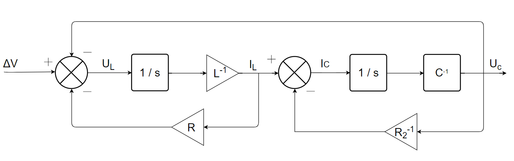
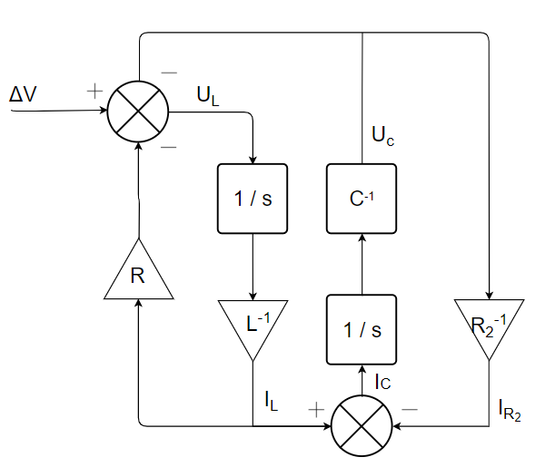
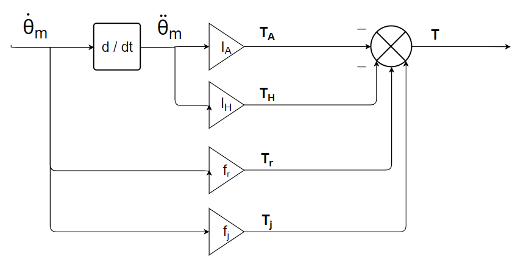
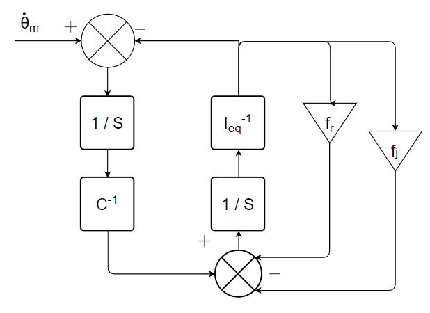

# Chapter 4 : Numerical simulation of multi-physics systems

  
 
 
## 5.1. Review of the different modelling methods

### 5.1.1. The electrical field

#### 1)	Model the system using the bond graph formalism : 

#### 2) Determine the block diagram model of the circuit : 

#### 3) Get the status representation of the system : 

\begin{gather}
\begin{bmatrix} \dot U_C \\\\ \dot I_L \end{bmatrix} = 
\begin{bmatrix} -R_2^{-1}.C^{-1} & C^{-1}\\\\ L^{-1} & R.L^{-1} \end{bmatrix}
\begin{bmatrix} U_C \\\\ I_L \end{bmatrix} + 
\begin{bmatrix} 0 \\\\ -L^{-1} \end{bmatrix}.\Delta V
\end{gather}

### 5.1.2. The mechanical field

Not corrected.

## 5.2. Causality studies and associated modifications

### 5.2.1. Two capacitors in parallel

#### 1) Model, using the bond graph formalism, the system under study - considering only the capacitive effect of capacitors.

#### 2) Attribute the causalities of the modelled system. Is it possible to obtain full causality for both capacitors ?

No, it's impossible. 

#### 3) In practice, a capacitor has internal resistance and inductance. These elements are both to be modelled in series of the capacitive effect. Update the bond graph model by considering these physical phenomena and conclude on the physical meaning of this model by attributing causalities.

The addition of these physical effects/phenomena allows the complete causalities of the model to be obtained.

### 5.2.2. The inertia of a submarine's propulsion system

#### 1) Considering the electric motor as an ideal source of speed, propose a bond graph model including the following physical phenomena: bearing and seal friction and shaft and propeller inertia.

#### 2) Assign causalities to the bond graph model and implement the associated block diagram model.

#### 4) Insert the shaft stiffness, detailed in Table 3.8, between the inertia and the electric motor. How many inertias are in causality derived ?

There is still a derivative causal inertia.

#### 5) Replace the two inertias by a single equivalent inertia. Determine the block diagram of the modelled system. Conclude on the preferential causalities of the model.

#### 6)	Propose an alternative method for eliminating derived causalities.

For example, it would be possible to consider a stiffness between the shaft and the propeller.

### 5.2.3. Causal stress: dry friction

#### 1) Apply flow causality to the R element of the bond graph 4.19.a and propagate the causalities to the model, promoting preferential causalities as much as possible. Discuss the behaviour of the friction model around a zero speed.

L'élément C est en causalité dérivée.

#### 2) In order to obtain full causality on element C, propose two new causal models :

1)  

2)If the characteristic of R is irreversible, it is no longer necessary to have it in causal flow. We can therefore have the following model :  

## Next : [Chapter 4. Problemes](Chapter 4. Problemes.ipynb)
