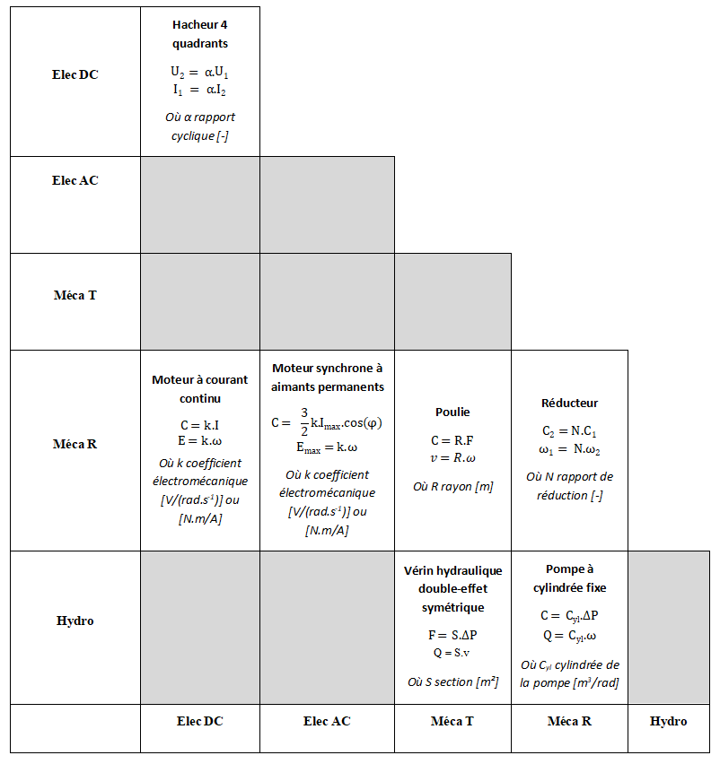
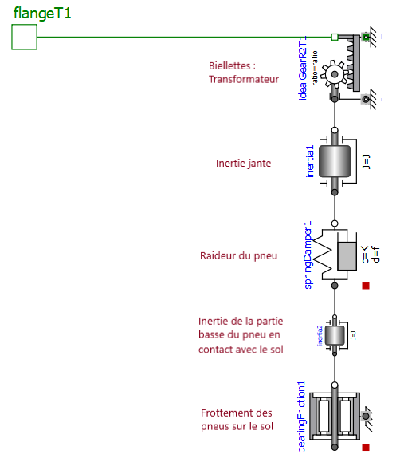

# Chapitre 3 : Mise en place d’un modèle à paramètres localisés 
  
 
 
## 5.1. Mise en place de réflexes d’analyse : Effet de stockage et dissipatifs

#### 1)	En fonction du phénomène à modéliser, cocher dans le tableau suivant le domaine physique et le type d’effet à prendre en compte :
1) **a et f**   
2) **b/c et h**   
3) **b/c et g**    
4) **a et h**    
5) **e et h**   
6) **a et g**    
7) **d et f**   
8) **e et f**    
9) **e et h**      
10) **c et g**     
11) **b/c et f**     
12) **d et h**    
13) **d et f**   

#### 2) Pour les dispositifs techniques représentés ci-dessous, indiquer l’effet dominant pour chaque partie a) à e) :
a) Ressort    
b) Inertie (masse en translation)     
c) Capacités électriques     
d) Ressort en rotation et amortissement visqueux     
e) Inertie en rotation     

### 5.1. Mise en place de réflexes d’analyse : Effet transformateurs

#### 1) Démontrer que les rapports de transformation $k_c$ et $k_e$ sont identiques
Moteur à courant continu idéal : 

\begin{align} 
P_{Rotation} &= P_{Electrique} \\\\
C.ω &= E.I \\\\
k_C.I.ω &= k_E.ω.I \\\\
k_C &= k_E 
\end{align}

#### 2) Compléter le tableau ci-dessous en indiquant les composants et les équations correspondantes des deux dispositifs suivants

## 5.2. Lien géométrie / réseau : analyse d’une direction assistée

#### 1) Entourez dans le tableau suivant le composant Modelica   

1) Moteur à courant continu : **c**  
2) Roue et vis sans fin : **e**      
3) Capteur de couple sans contact : **f**     
4) Embrayage : **d**    
5) Crémaillère et biellettes : **g et h** 

#### 2) Proposer un schéma Modelica modélisant le moteur à courant continu et prenant en compte les effets transformateur, dissipatif et de stockage d’énergie tant au niveau mécanique qu’électrique. 

#### 3) Indiquer sur le schéma les effets représentés par chacun des composants Modelica

## 5.3. Analyse systématique des effets : analyse d’un système d’injection directe par rampe commune 

 
1) Mécanique : source de vitesse en rotation         
2) Mécanique/Hydraulique : Transformateur           
3) Hydraulique : Capacité             
4) Hydraulique : Source de débit           
5) Hydraulique : Résistance hydraulique variable           
6) Hydraulique : Source de pression             

## Suite : [Chapitre 3. Problèmes](Chapitre 3. Problemes.ipynb)
