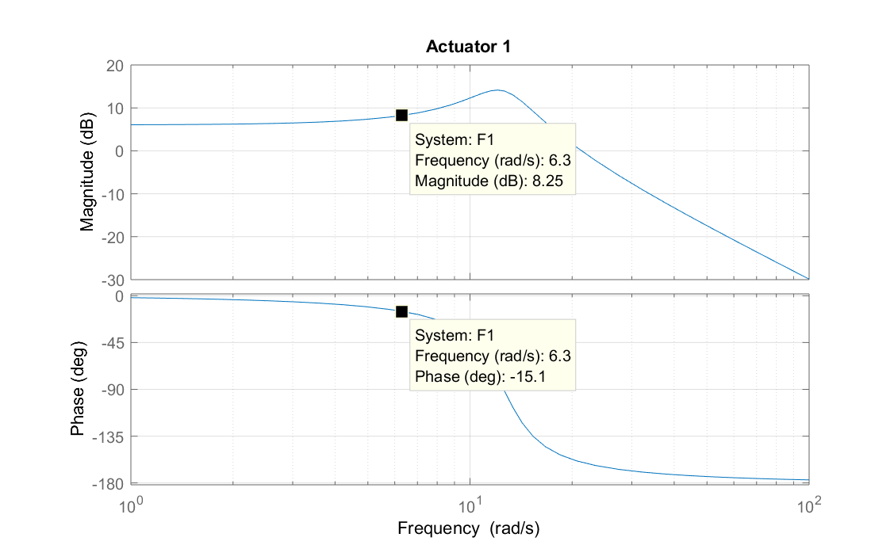
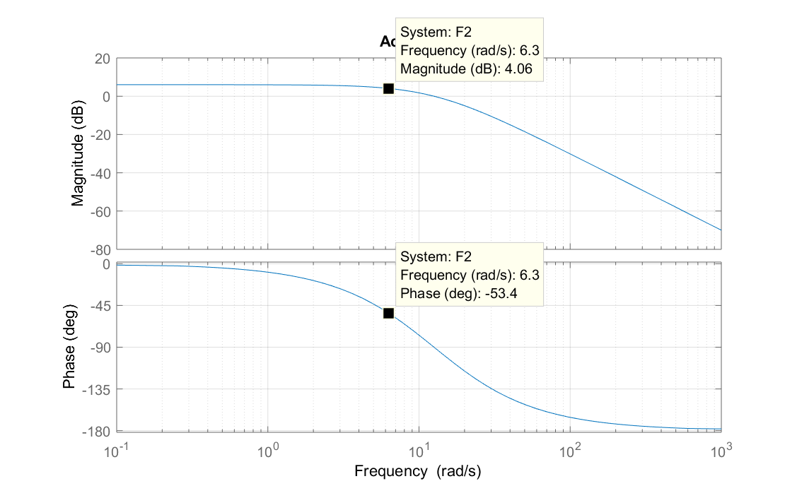
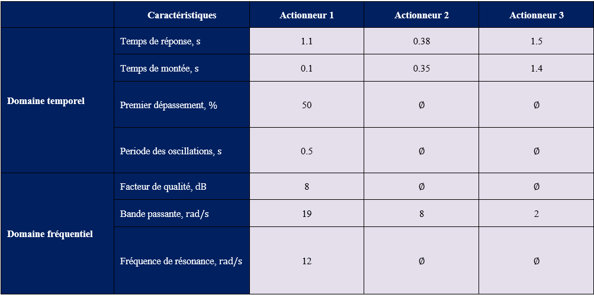

# Chapitre 5 : Outils d'analyse dynamique

## 5.1. Performance dynamique

#### 1) Donnez le temps de réponse à 5%, le temps de montée de 5% à 95% et le temps de pointe.

Actionneur 1 : $t_s\approx 1.1\, s$, $t_r \approx 0.1\, s$, $t_p\approx 0.25\, s$.      
Actionneur 2 : $t_s\approx 0.38\, s$, $t_r \approx 0.35\, s$, il n'y a pas d'oscillations.       
Actionneur 3 : $t_s\approx 1.5\, s$, $t_r \approx 1.4\, s$, il n'y a pas d'oscillations.

#### 2) Donnez le premier dépassement et la période de pseudo-oscillations.

Actionneur 1 : $M_p\approx 50\%$, $T \approx 0.5\, s$.     
Actionneur 2 et Actionneur 3 : il n'y a pas d'oscillations.   

#### 3) Calculez le gain correspondant à cette fréquence spécifique, en unités décimales et en décibels.

Actionneur 1 : $G(6.3)\approx 2.5\approx 8\, dB$.     
Actionneur 2 : $G(6.3)\approx 1.6\approx 4\, dB$.    
Actionneur 3 : $G(6.3)\approx 0.4\approx -8\, dB$.

#### 4) Calculez le déphasage correspondant à cette fréquence spécifique, en degrés.

Actionneur 1 : $\Delta t \approx 0.04\, s \Rightarrow \varphi(6.3)\approx -14°$.     
Actionneur 2 : $\Delta t \approx 0.15\, s \Rightarrow \varphi(6.3)\approx -54°$.     
Actionneur 3 : $\Delta t \approx 0.35\, s \Rightarrow \varphi(6.3)\approx -126°$.

#### 5) Sur les diagrammes de Bode correspondant aux trois Actionneurs (cf. figure 5.34), indiquer les points qui correspondent aux tests illustrés dans la figure 5.33. Vérifier la cohérence des gains et déphasages précédemment calculés avec ceux résultant des diagrammes de Bode.
 

#### 6) Sur les diagrammes de Bode, trouver les fréquences de coupure à -3 dB.
  
Actionneur 1 : $\omega_c\approx 19 \, rad/sec$     
Actionneur 2 : $\omega_c\approx 8 \, rad/sec$     
Actionneur 3 : $\omega_c\approx 2 \, rad/sec$     

#### 7) Sur les diagrammes de Bode se trouvent les fréquences de résonance et le facteur de qualité (résonance), $Q$.

Seul l'Actionneur 1 a une résonance, pour laquelle $\omega_r\approx 12\, rad/sec$ et $Q\approx 8\, dB$.

#### 8) Remplir le tableau 5.7 avec les valeurs des indicateurs de performance précédemment identifiés et souligner l'existence de relations qualitatives entre les indicateurs dans le domaine temporel et les indicateurs dans le domaine fréquentiel.

## 5.2. Fonctions de transfert

#### 1) Ecrire l'équation dynamique du mouvement de l'objet pour les deux configurations. La position de la masse est indiquée par $x$ et pour chaque configuration le sens positif est pris comme indiqué à la figure 5.36.b et c. Pour chaque configuration, l'origine du système de coordonnées est située sur l'électroaimant.

Pour la force répulsive :        
$$m\ddot{x}=c\frac{i^2}{x^2}-mg$$
 
Pour la force d'attraction :        
$$m\ddot{x}=mg-c\frac{i^2}{x^2}$$

#### 2) Expliquez pourquoi ce système d'entrée $i$ et de sortie $x$ est non linéaire.

Le carré sur le courant et la position, la division entre ces deux et la somme avec une constante sont des fonctions non linéaires.

#### 3) Pour les deux configurations, déterminez la position d'équilibre $x_{eq}$ pour un courant nominal de maintien dans l'aimant de $20 \, A$, si le coefficient $c=0.027\, Nm^2A^{-2}$.

Dans les deux cas $x_{eq}=1\, cm$

#### 4) L'accent est maintenant mis sur les mouvements verticaux de la masse autour de sa position d'équilibre $x_{eq}$. Montrer que la linéarisation du système autour de l'équilibre ($i_{eq},\, x_{eq}$) donne l'équation différentielle $\ddot{\Delta x}=\alpha\Delta i+\\beta\Delta x$ où $\Delta i$ est la variation courante autour du courant de maintien nominal $i_{eq}$ et $\Delta x$ est la variation de position de l'objet autour de $x_{eq}$. Trouvez les expressions analytiques de $\alpha$ et $\beta$ pour ces deux configurations.

Pour la force répulsive :      
$$\alpha=2\frac{mg}{i_{eq}}\quad\text{and}\quad \beta=-2\frac{mg}{x_{eq}}$$
 
Pour la force d'attraction :       
$$\alpha=-2\frac{mg}{i_{eq}}\quad\text{and}\quad \beta=2\frac{mg}{x_{eq}}$$

#### 5) $\Delta I(s)$ et $\Delta X(s)$ représentent les transformations de Laplace de $\Delta i$ et $\Delta x$, respectivement. Calculer la fonction de transfert $H(s)$ du système linéarisé autour de la position d'équilibre.

$$H(s)=\frac{\alpha}{p^2-\beta}$$

#### 6) Pour $x_{eq}=1\, cm$, et $i_{eq}=20\,A$, trouvez l'expression de la réponse du système linéarisé à une fonction delta Dirac. Diriez-vous que le système est stable, légèrement stable ou instable ?

Pour la force répulsive :     
$$\Delta x\approx 2.3\sin (4645t) $$     
Il s'agit d'un système marginalement stable.

Pour la force d'attraction :     
$$\Delta x\approx 1.2 e^{-4645t}-1.2 e^{4645t} $$     
C'est un système instable.

#### 7) La réponse à la question 5 était-elle suffisante pour décider de la stabilité du système ?

Oui. Dans le premier cas, nous avions 2 pôles purement imaginaires et dans le second cas, nous avions un pôle réel positif.
